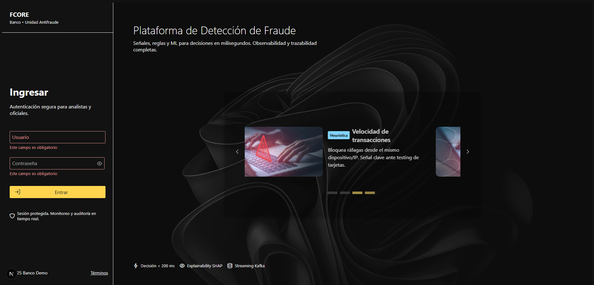

# FCORE – Fraud Detection Core System


[]()

---

## 📋 Table of Contents

- [About the Project](#about-the-project)
- [Current Stage](#current-stage)
- [Features Implemented](#features-implemented)
- [How to Run It](#how-to-run-it)
- [Technologies Used](#technologies-used)
- [Future Features](#future-features)
- [Contributors](#contributors)
- [License](#license)

---

## 🏗️ About the Project

FCORE is a **fraud detection core platform** designed to simulate a real-world banking scenario in Ecuador (USD).  
Its aim is to combine rule-based logic, machine learning scoring, and streaming/behavioral updates to identify fraudulent transactions.  
This project is developed under rigorous principles (KISS, SOLID, Clean Architecture) and will be presented as a demonstration robust enough for academic evaluation.

---

## 🚧 Current Stage

> :construction: **Under active development**

At this moment, the project includes:

- **User Authentication** (login with JWT stored in HTTP-only cookies)
- **CRUD for Analysts / Users** (creation, retrieval, update, deletion)
- Role-based access control (ADMIN vs ANALYST) in the backend
- Foundation of Clean Architecture and modular structure

You can use it as the groundwork to add the core fraud functionality in upcoming phases.

---

## ✅ Features Implemented

| Feature              | Description                                                             |
| -------------------- | ----------------------------------------------------------------------- |
| **Login / Auth**     | Analysts or admins can log in and receive access via secure cookies     |
| **User & Role CRUD** | Admins can create, update, list, and delete analyst users; assign roles |
| **RBAC Enforcement** | Endpoints protected by roles (only admins can manage users)             |

_User interface is minimal / in progress._

---

## ▶️ How to Run It

1. **Clone the repo**

   ```bash
   git clone https://github.com/yourusername/fcore.git
   cd fcore

   ```

2. **Configure environment variables**

- In backend/.env — set DATABASE_URL, SECRET_KEY, etc.
- In frontend/.env.local — set NEXT_PUBLIC_API_URL=http://localhost:8080/v1

2. **Run initalization commands**

- Backend:

  ```bash
      cd BE-FCORE
      .\env\Scripts\activate
      cd src
      python main.py

  ```

- Frontend:
  ```bash
      npm i next
      npm run dev
  ```

4. **Access services**

- Backend API: http://localhost:8080
- Frontend UI: http://localhost:3000

5. **Authentication / Admin seeds**
   The backend seeds a default admin and analyst user (check scripts/seed_users.py). Use those credentials to log in and manage users.

---

## 🛠️ Technologies Used

- Backend: Python, FastAPI, Pydantic, SQLAlchemy, Alembic
- Database: SQLite + (in future -> PostgreSQL)
- Auth / Security: JWT, bcrypt / argon2, RBAC
- Architecture: Clean Architecture (domain, use_cases, adapters, infrastructure)
- Frontend: Next.js (React), PrimeReact, React Query, zod
- DevOps: Docker + Docker Compose
- Streams / Messaging: (planeado) Kafka

---

## 🔮 Future Features

- Ingest transactions (streaming / API)
- Behavioral profile table + continuous updating
- Rule engine + rule hits explanations
- ML scoring (XGBoost) y combinación con reglas
- UI de alertas, investigacion, simulación
- Export de alertas / reportes (XLSX)
- Dashboard métricas (Grafana / Prometheus)
- Autenticación avanzada, audit logs, monitoreo

---

## 👥 Contributors

| Name                     | Role / Contact             |
| ------------------------ | -------------------------- |
| Gabriel Calderon(G4B0CM) | Lead Developer & Architect |

---

## 📜 License

This project is licensed under the MIT License — feel free to use, modify and distribute as needed.
